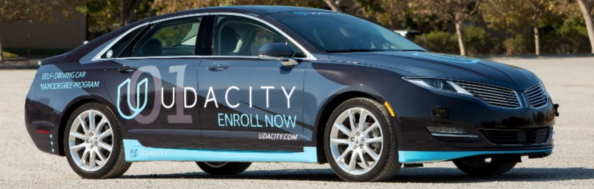

### Udacity Self-Driving Car Engineer Nanodegree
#### Term 3 &nbsp;|&nbsp; Project 13
# Capstone Project: Programming a Real Self-Driving Car

</img>

#### &nbsp;

### Team Information

Team Name: Delos Mobile

Team Members:
* [Justin Michela	| jmichela3@gmail.com](https://www.linkedin.com/in/justinmichela)
* [Daniel Han |	daniel88han@gmail.com](https://github.com/bigdan88)
* [Thomas Tracey |  tommytracey@gmail.com](https://www.linkedin.com/in/thomastracey)
* [Saajan Shridhar |	saajan.is@gmail.com](https://www.linkedin.com/in/saajan/)

Team Lead: Justin Michela

#### &nbsp;

---

#### &nbsp;

## Overview
This is the project repo for the final project of the Udacity Self-Driving Car Nanodegree in which we program a real self-driving car.

The **goal** of the project is to get Udacity's self-driving car to drive around a test track while avoiding obstacles and stopping at traffic lights.

[Here is a brief video](https://youtu.be/UT34zkxfS_M) from Udacity that explains the project in more detail.


#### &nbsp;
## Scope

There are three primary subsystems which need to be built and integrated in this project:

1. **Perception** &mdash; Takes in sensor data to localize the vehicle and detect various aspects of the driving environment (e.g., road lanes, traffic lights, etc.)
1. **Planning** &mdash; Determines the optimal path and target velocity to ensure a safe and smooth driving experience. Then updates the vehicle waypoints accordingly.
1. **Control** &mdash; Actuates the vehicles' steering, throttle, and brake commands to execute the desired driving path and target velocity.


</a>

As you can see, within each of the three subsystems, there are various components. These components are already quite familiar to us since we've built each of them throughout the prior 12 projects of the program. But we've yet to build an integrated system and test it on an actual car. So, for this final project we need to build and integrate a subset of these components.

At a high-level, we need to:

1. Get the car to drive safely and smoothly around the track.
1. Localize the car's position on the track.
1. Keep the car driving in the middle lane.
1. Use camera sensor data to detect traffic lights.
1. Classify whether the traffic light is green, yellow, or red.
1. Get the car to stop smoothly at red lights.
1. Get the car to smoothly resume driving when the light turns green.

First, we are required to get everything working in the simulator. Then, once approved, our code will be tested by Udacity in "Carla," the self-driving car pictured above.   


#### &nbsp;
## Approach

Here is a high-level breakdown of our approach.


### Perception

- Implement traffic light detection and classification using a convolutional neural network.


### Planning

- Implement a ROS node called the `waypoint_updater`. This node sets the target velocity for each waypoint based on any upcoming traffic lights or obstacles. For example, whenever the car needs to stop at a red light, this node will set decelerating velocities for the series of waypoints between the car and the traffic light.

### Control

- Implement a `drive_by_wire` ROS node. That takes target trajectory information as input and sends control commands to navigate the vehicle.


</a>

Udacity has provided a ROS framework for us to build and connect the nodes pictured above. This framework allows us to run our code in the simulator as well as the actual self-driving car.


#### &nbsp;
## Implementation & Testing
Here we outline in more detail the steps we took to build each of the various subsystems.

- _coming soon_


#### &nbsp;
## Results

- _coming soon_


#### &nbsp;
## Areas for Improvement

- _coming soon_


#### &nbsp;
#### &nbsp;

---
# Running the Project

#### Important notes
The VM that we tested on was limited on resources. As a result, a lag is observed when all the ROS components are running simultaneously and the lag worsens progressively.

To overcome this problem, we turn the camera off in simulator (effectively disabling the Traffic Light detection component) unless a Traffic Light is on the horizon.

This should not be required on a machine with higher specs.

#### &nbsp;
## Starter Code

Please use **one** of the two installation options, either native **or** docker installation.

### Native Installation

* Be sure that your workstation is running Ubuntu 16.04 Xenial Xerus or Ubuntu 14.04 Trusty Tahir. [Ubuntu downloads can be found here](https://www.ubuntu.com/download/desktop).
* If using a Virtual Machine to install Ubuntu, use the following configuration as minimum:
  * 2 CPU
  * 2 GB system memory
  * 25 GB of free hard drive space

  The Udacity provided virtual machine has ROS and Dataspeed DBW already installed, so you can skip the next two steps if you are using this.

* Follow these instructions to install ROS
  * [ROS Kinetic](http://wiki.ros.org/kinetic/Installation/Ubuntu) if you have Ubuntu 16.04.
  * [ROS Indigo](http://wiki.ros.org/indigo/Installation/Ubuntu) if you have Ubuntu 14.04.
* [Dataspeed DBW](https://bitbucket.org/DataspeedInc/dbw_mkz_ros)
  * Use this option to install the SDK on a workstation that already has ROS installed: [One Line SDK Install (binary)](https://bitbucket.org/DataspeedInc/dbw_mkz_ros/src/81e63fcc335d7b64139d7482017d6a97b405e250/ROS_SETUP.md?fileviewer=file-view-default)
* Download the [Udacity Simulator](https://github.com/udacity/CarND-Capstone/releases).

### Docker Installation
[Install Docker](https://docs.docker.com/engine/installation/)

Build the docker container
```bash
docker build . -t capstone
```

Run the docker file
```bash
docker run -p 4567:4567 -v $PWD:/capstone -v /tmp/log:/root/.ros/ --rm -it capstone
```

### Port Forwarding
To set up port forwarding, please refer to the [instructions from term 2](https://classroom.udacity.com/nanodegrees/nd013/parts/40f38239-66b6-46ec-ae68-03afd8a601c8/modules/0949fca6-b379-42af-a919-ee50aa304e6a/lessons/f758c44c-5e40-4e01-93b5-1a82aa4e044f/concepts/16cf4a78-4fc7-49e1-8621-3450ca938b77)

### Usage

1. Clone the project repository
```bash
git clone https://github.com/udacity/CarND-Capstone.git
```

2. Install python dependencies
```bash
cd CarND-Capstone
pip install -r requirements.txt
```
3. Make and run styx
```bash
cd ros
catkin_make
source devel/setup.sh
roslaunch launch/styx.launch
```
4. Run the simulator

### Real world testing
1. Download [training bag](https://s3-us-west-1.amazonaws.com/udacity-selfdrivingcar/traffic_light_bag_file.zip) that was recorded on the Udacity self-driving car.
2. Unzip the file
```bash
unzip traffic_light_bag_file.zip
```
3. Play the bag file
```bash
rosbag play -l traffic_light_bag_file/traffic_light_training.bag
```
4. Launch your project in site mode
```bash
cd CarND-Capstone/ros
roslaunch launch/site.launch
```
5. Confirm that traffic light detection works on real life images
